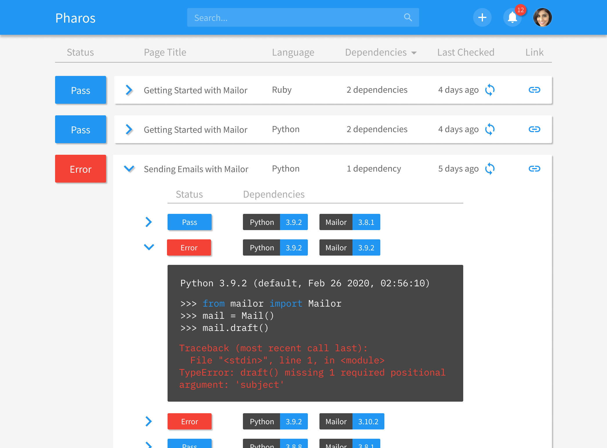
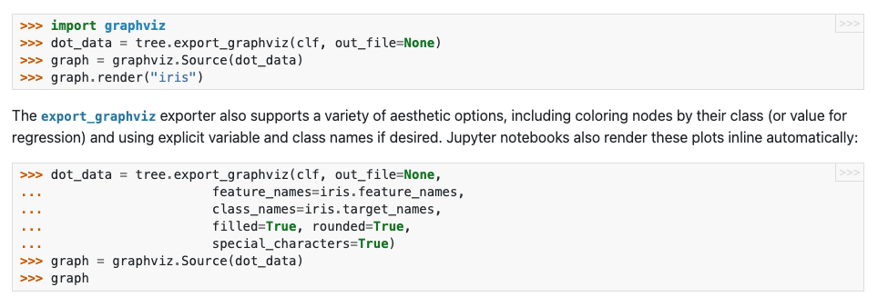
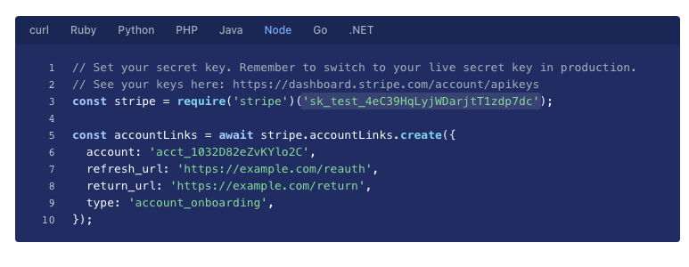

# Pharos

> If docs are code, [Pharos](https://tutorialhub.globalunderdog.com/) provides continuous integration.

Pharos uses continuous integration (CI) to spot bugs in documentation and tutorial code and keeps up with a rapidly changing product and technology environment.

There are three reasons your doc code may have a bug:

1. **Revision**: an edit introduced a bug
2. **Iteration**: the underlying product changed as we iterate on our product
3. **Provision**: the external dependencies that we provisioned changed

Pharos can protect against all three by rerunning your code each time one of these three **tiggers** happens:

1. Immediately after docs are created or updated (to catch revision bugs)
2. Weekly (to catch iteration bugs)
3. Whenever there are new versions of the language or dependencies available (to catch provision bugs)

The results of CI runs are displayed on your dashboard and errors are reported:



# From Code Snippets to Sessions

Each page of a doc or tutorial may contain multiple code snippets (typically in `pre` tags). Often, there are multiple snippets, each a step meant to be run consecutively in a single session:



There can be multiple sessions on a page, often in different languages:


Pharos supports both of these use cases through a **Session**, a series of commands in a single language meant to be run consecutively without throwing an exception. Each Session is represented by a json blob:

```javascript
{
    id: string,
    // the unique ID of the Session.  Must be [0-9a-zA-Z_]{1,32}.
    // We suggest hashing the URL and language attributes

    url?: string,
    // optional url of the documentation page.  Referenced in error reporting.

    lang: SemVer<"python" | "ruby" | "typescript" | "javascript">,
    // the language and its semver

    dependencies?: SemVer<string>[],
    // an optional list of dependencies with semver that are installed
    // before running code

    code: string | string[],
    // either a single string of code with newlines or
    // an array of the lines of code (more precise error messages).

    before?: string | string[],
    after?: string | string[],
    // code that is run immediately before or after `code`,
    // typically for setup and teardown
}
```

The expression `SemVer<T>` is a string of type `T` followed by white space and a valid [semver](https://semver.org/) string, e.g.

```
python 1.2.*
express ^1.2.3
node ~1.2.3
```

If no semver is specified, only the latest version of the dependency is assumed.

## API

There are three operations we can perform on a session:

- **Upsert**: you can create or update a session when you create a new doc page or modify that doc page. The operation is idempotent and will do nothing is no code has changed in the session. Pass the data field as a Session object serialized json:

  ```bash
  curl https://pharos-api.globalunderdog.com/upsert
    -u API_KEY
    -d "{...[Session Object]}"
  ```

  If the `id` field already exists, the query updates the Session object. If the `id` field does not, the query creates a new Session object.

- **Rerun**: you can rerun a session if you know that you have updated your API and want to test that your code. Pass the id field as data:

  ```bash
  curl https://pharos-api.globalunderdog.com/rerun
    -u API_KEY
    -d "[id]"
  ```

- **Delete**: you can delete a session when you no longer need it anymore, e.g. if you are retiring a doc page. Pass the id field as data:
  ```bash
  curl https://pharos-api.globalunderdog.com/delete
    -u API_KEY
    -d "[id]"
  ```
